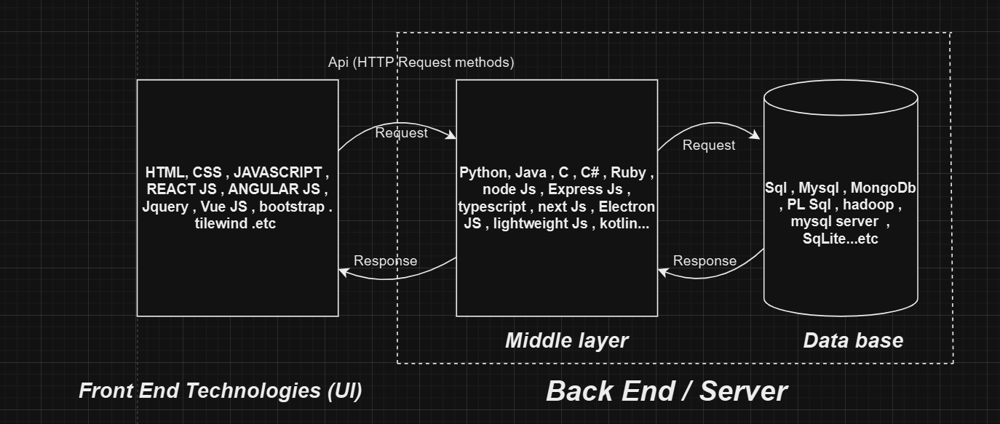
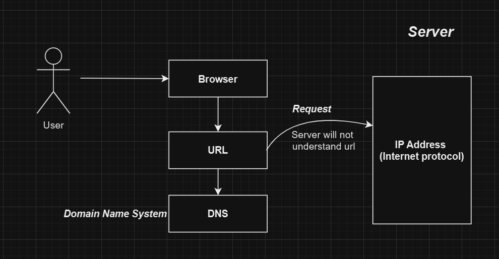

# About Technologies


## 3-Tier Architecture


→ **3-Tier Architecture** is a software architecture model that divides an application into **three layers**.

### Layers in 3-Tier Architecture:
1. Front End
2. Middle Layer
3. Database





### Front End

→ Whatever the user **sees and interacts with** on the UI (User Interface) is called the **Front End**.

### Middle Layer / Server / Business Layer / Logic Layer

→ This layer contains the **main logic** of the web application.

### Database Layer

→ This layer stores **all information and data** required to run the web application.


## How Browser Works


### Work Flow




1. User enters a website URL in the browser.
2. DNS converts domain name into IP address.
3. Browser sends HTTP request to server.
4. Server sends response.
5. Browser renders the page.


## Types of Web Applications


### 1. Static Web Application
- Any web application that **does not have functionality**
- Used only to display information
- Built using **HTML and CSS**
- No interaction with users


### 2. Dynamic Web Application
- Any web application that **has functionality**
- User interaction is possible
- Built using **HTML, CSS, and JavaScript**
- Examples: Login pages, forms, dashboards


## HTML


- HTML is used to build **web page structure**
- HTML stands for **Hyper Text Markup Language**
- HTML is a **standard markup language**
- HTML was introduced in **1991**
- Developed by **Tim Berners-Lee**
- HTML contains a series of **elements**
- Latest version of HTML is **HTML5**


### HTML Structure / HTML Boilerplate
---

An **HTML Boilerplate** is a basic template that includes the essential structure of an HTML document.

```html
<!DOCTYPE html>
<html lang="en">
<head>
  <meta charset="UTF-8">
  <meta name="viewport" content="width=device-width, initial-scale=1.0">
  <title>Document</title>
</head>
<body>

</body>
</html>
```

## HTML Tags

- Tags are predefined keywords enclosed within angle brackets `< >`.

### Examples:
```html
<h1></h1>
<p></p>

<br>
```


## Types of Tags

### 1. Paired Tags
- Have both opening and closing tags.

**Examples:**
```html
<h1></h1>
<p></p>
<div></div>
```

#### Formatting Tags:
- `<b></b>`
- `<strong></strong>`
- `<i></i>`
- `<em></em>`
- `<mark></mark>`
- `<u></u>`
- `<strike></strike>`
- `<sub></sub>`
- `<sup></sup>`

### 2. Unpaired / Self-Closing Tags


- Have  only opening tag.

**Examples:**
```html
<br>
<hr>

<input>
```

---

## HTML Elements

Combination of opening tag, content, and closing tag.

**Example:**
```html
<h1>Hello World</h1>
```

### Types of Elements:

#### 1. Block-Level Elements
- Occupy full width
- Start on new line
- Examples: `<div>`, `<p>`, headings

#### 2. Inline Elements
- Occupy content width only
- Examples: `<span>`, `<b>`, `<i>`


## HTML Attributes

- Provide additional information about elements
- Written inside opening tag
- Written in key-value pair
- Every HTML Elements having Attributes 

**Example:**
```html
<h1 align="center" style="color:red;">HTML Attributes</h1>
```

Common Attributes:
- `id`
- `class`
- `style`
- `title`


## Marquee Tag

- Used to scroll content on the webpage
- Deprecated (used for learning purpose)

**Attributes:**
- direction : left , right , up , down
- behavior :scroll , slide
- height
- width
- scrollamount
- loop

**Example:**
```html
<marquee direction="right">Welcome to HTML</marquee>
```


## Image Tag


- `` is used to display images

**Attributes:**

- **`src`**  
  - Used to specify the **image address / image path**
  - Types of image paths:
    - **Relative Path**  
      → Browser image address  
      → Example: `https://google.com/images/photo.jpg`
    - **Absolute Path**  
      → Local or downloaded image path  
      → Example: `C:/images/photo.jpg`

- **`alt`**  
  - Specifies **alternate text** for the image  
  - Displayed when the image cannot be loaded  
  - Helps in accessibility and SEO

- **`height`**  
  - Used to set the **height** of the image

- **`width`**  
  - Used to set the **width** of the image


## Lists in HTML


→ A **list in HTML** is used to display a group of related items in a structured and organized manner.  
→ HTML provides different types of lists to present content clearly.

### Types of Lists:
1. Ordered List
2. Unordered List
3. Description List
4. Nested List


### Ordered List
----------------

→ An **Ordered List** is used to display items in a **specific sequence or order**.  
→ Each item in the list is marked with **numbers, letters, or Roman numerals**.

- In HTML, to display an ordered list, we use the `<ol></ol>` tag.
- An ordered list contains list items defined using the `<li></li>` tag.


```html
<ol type="A">
  <li>HTML</li>
  <li>CSS</li>
  <li>JavaScript</li>
</ol>
```

**Attributes:**
- type :  1 , a, A, i ,I
- start
- reversed

---
